# A Guide to Convolutional Neural Networks (CNNs)

**Author:** Phil Mui · **Term:** Spring 2026 · **Affiliation:** ASDRP

---

**Who is this for?** This tutorial is written so that a 9th-grade student can follow along and understand the main ideas behind Convolutional Neural Networks. No advanced math is required—we use plain language and examples.

**What you'll learn:** What CNNs are, how they "see" images, and how two famous architectures—**LeNet** and **AlexNet**—work. You'll also learn what layers, nodes, loss functions, dropouts, normalizations, pooling, and activations mean and why we use them.

---

## Table of Contents

1. [What Is a Convolutional Neural Network?](#1-what-is-a-convolutional-neural-network)
2. [Core Building Blocks](#2-core-building-blocks)
3. [Layers, Nodes, and How Information Flows](#3-layers-nodes-and-how-information-flows)
4. [Activation Functions](#4-activation-functions)
5. [Pooling Layers](#5-pooling-layers)
6. [Loss Functions](#6-loss-functions)
7. [Optimizers](#7-optimizers)
8. [Dropout](#8-dropout)
9. [Normalization](#9-normalization)
10. [The LeNet Architecture](#10-the-lenet-architecture)
11. [The AlexNet Architecture](#11-the-alexnet-architecture)
12. [Putting It All Together](#12-putting-it-all-together)

---

## 1. What Is a Convolutional Neural Network?

A **Convolutional Neural Network (CNN)** is a type of artificial neural network designed to work with **images**. Instead of treating an image as one long list of numbers (pixels), a CNN uses small "windows" called **filters** that slide across the image to detect patterns like edges, textures, and shapes. That way, the network can learn *what* is in the picture—for example, "this is a cat" or "this is a truck."

**Why "convolutional"?** The math operation used when the filter slides over the image is called a **convolution**. You can think of it like a stamp: the filter is the stamp, and we stamp it everywhere on the image and record how well it matches at each spot.

**Real-world analogy:** Imagine you're looking for the letter "E" in a word search. You don't look at the whole grid at once; you move a small mental "template" of "E" across the grid and see where it fits. A CNN does something similar with learned templates (filters) for edges, curves, and eventually whole objects.

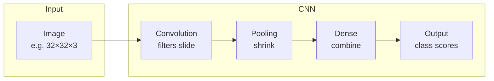

---

## 2. Core Building Blocks

Before we look at full architectures like LeNet and AlexNet, it helps to know the main pieces:

| Building block | What it does (simple version) |
|----------------|-------------------------------|
| **Convolution layer** | Slides small filters over the image to detect patterns (edges, textures). |
| **Pooling layer** | Shrinks the image a bit and keeps the strongest signals. |
| **Activation function** | Decides how "active" each neuron is (e.g., turn negative values into 0). |
| **Fully connected (Dense) layer** | Connects many neurons together to make a final decision (e.g., which class). |
| **Loss function** | Measures how wrong the network's guess was. |
| **Optimizer** | Updates the network's weights to reduce the loss. |
| **Dropout** | Randomly turns off some neurons during training to reduce overfitting. |
| **Normalization** | Adjusts values so they stay in a good range for training. |

### Quick example: what does a convolution do?

Imagine a tiny 3×3 image and a 2×2 filter:

- **Image (3×3):**  
  `1 2 1`  
  `0 1 0`  
  `1 2 1`

- **Filter (2×2):**  
  `1 0`  
  `0 1`

We *slide* the filter over the image. At each position we multiply matching numbers and add them up. For example, with the filter on the top-left: (1×1 + 2×0 + 0×0 + 1×1) = 2. So one output value is 2. We do this everywhere the filter fits and get a new (smaller) grid of numbers. That grid is one "feature map." A convolution layer has many filters, so it produces many feature maps—each one can learn to detect a different pattern (edge, corner, etc.).

We'll go through each building block in more detail below.

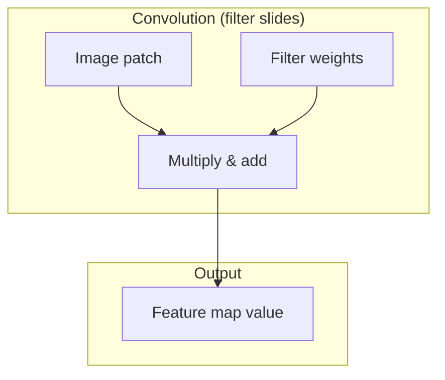

---

## 3. Layers, Nodes, and How Information Flows

### What is a layer?

A **layer** is one step in the network. Data enters at the **input layer** (your image), passes through **hidden layers** (convolution, pooling, dense, etc.), and leaves at the **output layer** (e.g., 10 numbers for 10 classes).

- **Input layer:** Holds the raw image. For a 32×32 color image, you can think of it as 32×32×3 numbers (height × width × 3 color channels: red, green, blue).
- **Hidden layers:** Do the actual work—convolutions find features, pooling shrinks, dense layers combine everything.
- **Output layer:** Produces the final answer. For 10 classes (e.g., CIFAR-10: airplane, car, bird, …), the output has 10 numbers. The highest one is the predicted class.

### What is a node (neuron)?

A **node** (or **neuron**) is one "unit" in a layer. It receives numbers from the previous layer, does a small calculation (often: multiply by weights, add a bias, then apply an activation), and sends a number forward.

- In a **convolution layer**, each "location" in the output grid is like a node. So if the output shape is 28×28×6, you have 28×28×6 nodes (each filter gives one 28×28 grid).
- In a **dense layer**, each row is one node. A Dense(120) layer has 120 nodes; each node is connected to every value from the previous layer.

**Example:** In LeNet, the first convolution takes a 32×32×3 image and outputs 28×28×6. So we go from 32×32×3 = 3,072 "input nodes" to 28×28×6 = 4,704 "output nodes" (organized in a grid, not a single list).

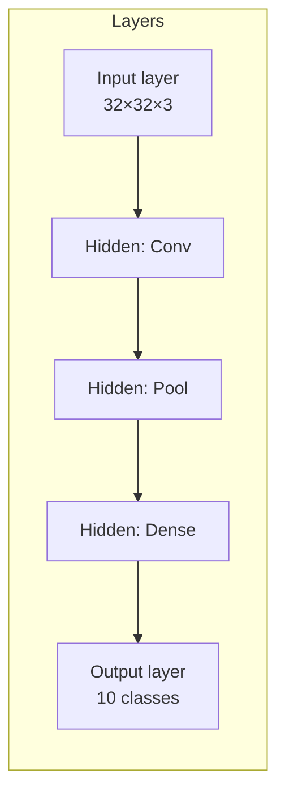

---

## 4. Activation Functions

An **activation function** takes the number coming out of a node and changes it before passing it to the next layer. It adds **non-linearity**: without it, stacking many layers would be the same as one big linear layer, and the network couldn’t learn complex patterns.

### ReLU (Rectified Linear Unit)

- **Rule:** If the value is positive, leave it. If it’s negative, replace it with 0.
- **Why we use it:** Simple, fast, and helps avoid the "vanishing gradient" problem so training stays stable. Both LeNet and AlexNet use ReLU (modern versions; original LeNet used tanh).
- **Example:** Inputs [2, -1, 0, 3] → Outputs [2, 0, 0, 3].

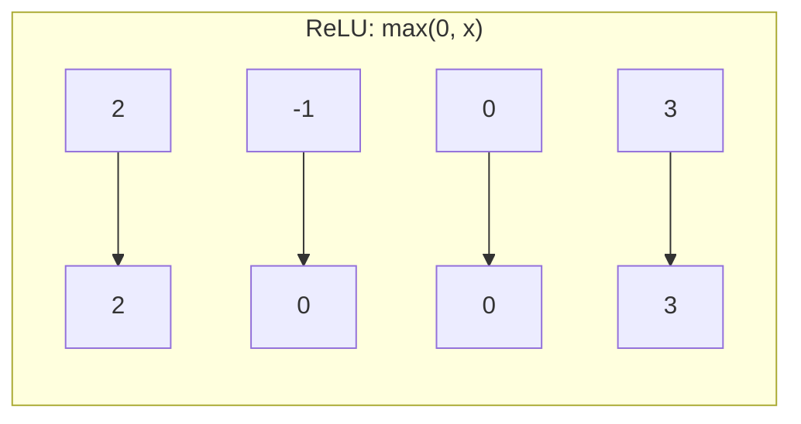

### Softmax

- **Rule:** Takes a list of numbers (e.g., scores for each class) and turns them into **probabilities**: all between 0 and 1, and they add up to 1.
- **Where we use it:** Usually only on the **last layer** for classification. The class with the highest probability is the prediction.
- **Example:** Scores [2.0, 0.5, 0.1] → after softmax something like [0.7, 0.2, 0.1]. So "class 0" is predicted.

### Tanh (hyperbolic tangent)

- **Rule:** Squashes values into the range -1 to 1.
- **Note:** Original LeNet used tanh. Many modern CNNs use ReLU instead because it often trains better.

---

## 5. Pooling Layers

After a convolution, we often use a **pooling layer** to reduce the size of the feature maps and keep the strongest responses.

### Max pooling

- **What it does:** Divides the image into small windows (e.g., 2×2 or 3×3). In each window, it **keeps only the largest value** and throws away the rest.
- **Why:** Makes the network care less about *exact* position of a feature (a little shift doesn’t change the max much) and reduces size so we need fewer parameters and computations.
- **Example:** A 2×2 max pool on values [[1, 3], [2, 4]] gives 4 (the max in that block).

**AlexNet** uses **max pooling** (e.g., 3×3 windows, stride 2) to shrink the feature maps and keep the strongest activations.

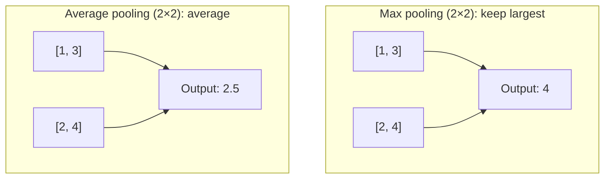

### Average pooling

- **What it does:** In each window, it takes the **average** of all values.
- **Why:** Smoother than max pooling; the original **LeNet** used average pooling (e.g., 2×2, stride 2) to gently reduce size while smoothing the features.

---

## 6. Loss Functions

The **loss function** tells the network "how wrong" its current prediction is. The optimizer then tries to **minimize** this loss by updating the weights.

### Sparse Categorical Cross-Entropy

- **Used when:** Each image belongs to **exactly one class**, and labels are **integers** (0, 1, 2, …, 9).
- **What it does:** Compares the network’s predicted probabilities (e.g., from softmax) to the true class. If the network is confident and correct, loss is low; if it’s wrong or unsure, loss is high.
- **Why "sparse"?** The label is a single number (e.g., 3 for "cat"), not a one-hot vector like [0, 0, 0, 1, 0, …].
- **Example:** True class = 2 (bird). If the model gives high probability to class 2, loss is small. If it gives high probability to class 5 (dog), loss is large.

Both the **LeNet** and **AlexNet** notebooks use **Sparse Categorical Cross-Entropy** because CIFAR-10 has 10 classes and labels are integers 0–9.

### Other loss functions (for context)

- **Categorical cross-entropy:** When labels are **one-hot** (e.g., [0, 0, 1, 0, …]).
- **Binary cross-entropy:** For **two classes** or multi-label problems.

### What is an "algorithm" in this context?

When we say **algorithm**, we mean a step-by-step procedure. In CNNs, the main ones you meet are:

- **Forward pass:** The algorithm that takes an image, passes it through each layer (conv → activation → pool → … → softmax), and produces a prediction.
- **Optimizer (e.g., Adam):** The algorithm that looks at the loss and decides **how to update each weight** so the loss goes down. So "training" = run forward pass → compute loss → run optimizer to update weights → repeat.

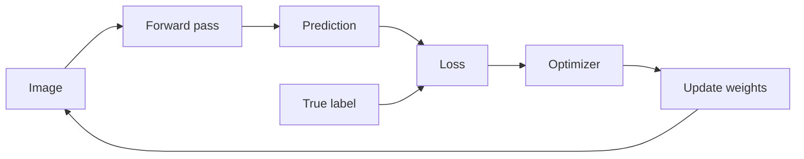

---

## 7. Optimizers

The **optimizer** is the algorithm that **updates the network’s weights** after each batch of data. The loss tells us *how wrong* we are; the optimizer decides *how to change each weight* so that the loss goes down over time. Without an optimizer, the weights would never change and the network could not learn.

### What is an optimizer supposed to do?

1. **Use the loss:** After a forward pass, we have a loss value. The optimizer uses the **gradient** of the loss with respect to each weight—a measure of “which direction and how much each weight affects the loss.”
2. **Update each weight:** It takes a small step in the direction that *reduces* the loss. So weights that were making the loss worse get nudged one way, and weights that were helping get nudged another way.
3. **Repeat:** Over many batches and epochs, these small updates push the network toward weights that give lower loss and better predictions.

**Why we need it:** The network has thousands or millions of weights. We can’t guess them by hand. The optimizer automates “try a small change, see if loss goes down, keep the change if it helps”—for every weight, every step.

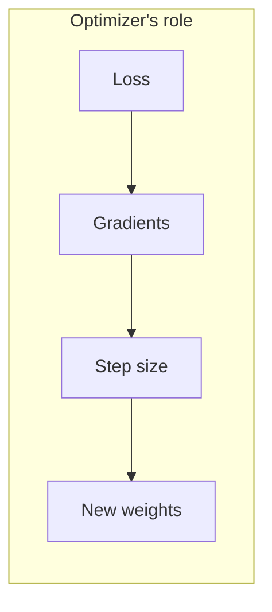

### Adam (Adaptive Moment Estimation)

**Adam** is a widely used optimizer. It is “adaptive”: it adjusts **how big a step to take** for each weight individually, instead of using one global step size for everything.

- **What it does:** For each weight, Adam keeps a running average of (1) recent gradients (“momentum”—so we don’t zigzag too much) and (2) the square of recent gradients (so we know which weights have big vs small updates). It then takes a step that is larger when the gradient is stable and smaller when the gradient is noisy or when that weight has already been updated a lot.
- **Why use it:** It usually works well “out of the box” with a default learning rate (e.g. 1e-3 or 1e-4), trains quickly, and handles noisy or sparse gradients better than plain SGD. That’s why the LeNet and AlexNet notebooks both use Adam.
- **Learning rate:** You still choose a **learning rate** (e.g. `1e-3`). It sets the overall scale of the updates. Too large and training can be unstable; too small and learning is slow. Adam makes the effective step size *per weight* adaptive around that scale.

**In short:** The optimizer’s job is to **minimize the loss by updating weights**. Adam does that by taking adaptive, per-weight steps using momentum and scaled gradients, which is why it’s a common default for CNNs like LeNet and AlexNet.

---

## 8. Dropout

**Dropout** is a regularization technique: during training, we **randomly "turn off"** a fraction of the neurons (set their output to 0). The remaining neurons have to carry the load, so the network doesn’t rely too much on any single neuron.

- **Why we use it:** Reduces **overfitting** (memorizing the training set instead of learning general patterns). When some neurons are dropped, the network can’t depend on one path and must learn more robust features.
- **Typical value:** 0.5 means "randomly drop 50% of the neurons in this layer during each training step."
- **Where it’s used:** Usually in the **fully connected (dense)** part of the network, not in the convolution layers. **AlexNet** uses Dropout(0.5) after the first and second dense layers.

**LeNet** in our notebook does **not** use dropout (it’s small and simple). **AlexNet** uses dropout because it has large dense layers and more risk of overfitting.

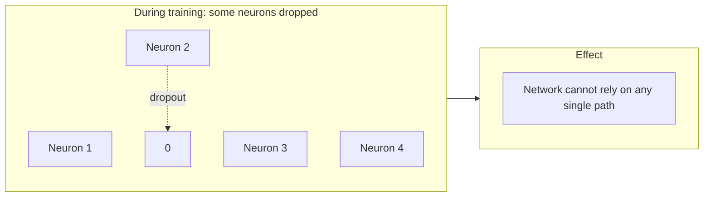

---

## 9. Normalization

**Normalization** means adjusting the values in the network so they stay in a good range (e.g., similar scale). This often makes training faster and more stable.

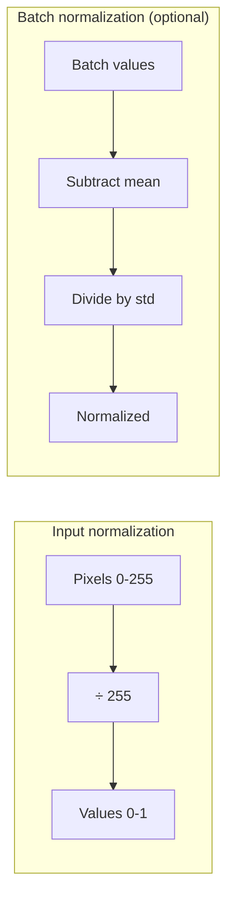

### Input normalization

- **What:** Scale pixel values from 0–255 to something like 0–1 (divide by 255).
- **Why:** Keeps inputs in a range that works well with the rest of the math. Both LeNet and AlexNet notebooks do this.

### Batch Normalization (BatchNorm)

- **What:** For each small batch of data, we compute the mean and standard deviation of each channel (or each neuron) and then subtract the mean and divide by the standard deviation. So each layer sees data that is roughly "centered" and on a similar scale.
- **Why:** Speeds up training and can allow higher learning rates. Many modern CNNs use it.
- **Note:** The original **AlexNet** used **Local Response Normalization (LRN)**. Our AlexNet notebook omits LRN for simplicity; BatchNorm is a common modern replacement when you want normalization.

---

## 10. The LeNet Architecture

**LeNet-5** (1998) is one of the earliest successful CNNs. It was designed for recognizing **handwritten digits** (e.g., MNIST). The notebooks implement a version adapted to **CIFAR-10** (32×32 color images, 10 classes). You can follow along in `notebooks/LeNet CIFAR-10.ipynb`.

### Big idea

LeNet uses a simple pattern: **Convolution → Pooling → Convolution → Pooling → Flatten → Dense → Dense → Output.**

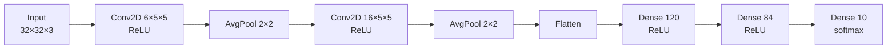

### Layer-by-layer (CIFAR-10 version)

1. **Input:** 32×32×3 (height × width × 3 color channels).
2. **Conv2D(6, 5×5, ReLU):** 6 filters of size 5×5. Output size 28×28×6 (we lose a little size at the edges with "valid" padding).
3. **AveragePooling2D(2×2, stride 2):** Shrinks to 14×14×6.
4. **Conv2D(16, 5×5, ReLU):** 16 filters. Output 10×10×16.
5. **AveragePooling2D(2×2, stride 2):** Shrinks to 5×5×16 = 400 values.
6. **Flatten:** 400 numbers in a single vector.
7. **Dense(120, ReLU):** 120 neurons, fully connected.
8. **Dense(84, ReLU):** 84 neurons.
9. **Dense(10, softmax):** 10 outputs (one per class); softmax gives probabilities.

### Why these choices?

- **Small filters (5×5):** LeNet was designed for small images; 5×5 is enough to capture local patterns.
- **Average pooling:** Original LeNet used it for smoothing; the notebook keeps it for a classic feel.
- **ReLU:** The notebook uses ReLU instead of the original tanh so training is simpler and more stable.
- **No dropout:** The model is small; dropout is often added in larger nets (like AlexNet).

### Parameter count (from the notebook)

- Total parameters: about **62,006** (e.g., 456 for first conv, 2,416 for second conv, 48,120 for first dense, etc.). This is tiny compared to modern deep networks.

---

## 11. The AlexNet Architecture

**AlexNet** (2012) helped start the modern deep-learning boom. It was trained on **ImageNet** (large images, many classes). The notebooks implement a version for **CIFAR-10**, with images resized to 227×227 to match the expected input size. You can follow along in `notebooks/AlexNet CIFAR-10.ipynb`.

### Big idea

AlexNet stacks **more and larger** convolution layers, uses **max pooling**, **ReLU**, and **dropout** in the dense layers. So: more depth, more filters, and explicit regularization.

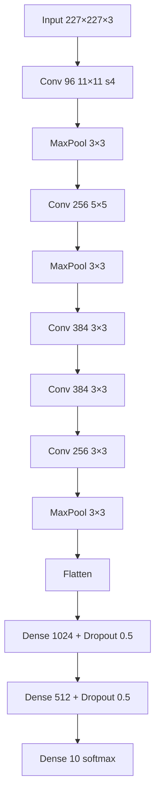

### Layer-by-layer (notebook version)

1. **Input:** 227×227×3.
2. **Conv2D(96, 11×11, stride 4, ReLU):** Large filters, big stride. Output 55×55×96.
3. **MaxPooling2D(3×3, stride 2):** → 27×27×96.
4. **Conv2D(256, 5×5, padding same, ReLU):** → 27×27×256.
5. **MaxPooling2D(3×3, stride 2):** → 13×13×256.
6. **Conv2D(384, 3×3, padding same, ReLU):** → 13×13×384.
7. **Conv2D(384, 3×3, padding same, ReLU):** → 13×13×384.
8. **Conv2D(256, 3×3, padding same, ReLU):** → 13×13×256.
9. **MaxPooling2D(3×3, stride 2):** → 6×6×256.
10. **Flatten:** 6×6×256 = 9,216 values.
11. **Dense(1024, ReLU)** then **Dropout(0.5)**.
12. **Dense(512, ReLU)** then **Dropout(0.5)**.
13. **Dense(10, softmax):** 10 classes.

### Why these choices?

- **Large first filter (11×11, stride 4):** Looks at big patches of the image at once and quickly reduces size.
- **Max pooling:** Keeps the strongest activations; standard in modern CNNs.
- **More conv layers (3×3):** Deeper network can learn more complex features.
- **Dropout(0.5):** Large dense layers (1024, 512) would overfit easily; dropout reduces that.
- **No LRN:** Original AlexNet had Local Response Normalization; the notebook omits it for simplicity.

### Differences from LeNet

| Aspect | LeNet | AlexNet |
|--------|--------|---------|
| Size | Small (~62K params) | Large (~13M+ params in notebook) |
| Input | 32×32 | 227×227 (resized in notebook) |
| Pooling | Average 2×2 | Max 3×3, stride 2 |
| Conv pattern | 2 blocks (conv+pool) | 5 conv layers, 3 pools |
| Dense | 120 → 84 → 10 | 1024 → 512 → 10 |
| Dropout | None | 0.5 after each dense |
| Normalization | Input only | Input only (no LRN in notebook) |

---

## 12. Putting It All Together

### Training loop (same idea in both notebooks)

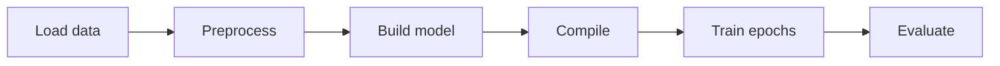

1. **Load data:** CIFAR-10 images and labels (0–9).
2. **Preprocess:** Normalize pixels (e.g., /255), optionally resize (AlexNet), and use data augmentation (e.g., random flip, small translation) for training.
3. **Build model:** Stack conv, pool, flatten, dense (and dropout for AlexNet) as above.
4. **Compile:** Choose loss = `SparseCategoricalCrossentropy`, optimizer = `Adam`, metrics = `accuracy`.
5. **Train:** For several epochs, the network sees batches of images, computes loss, and updates weights to minimize it.
6. **Evaluate:** Check accuracy (and loss) on a held-out test set.

### What each piece is for (quick recap)

- **Convolution layers:** Detect patterns (edges → textures → parts → objects).
- **Pooling:** Shrink and keep strong signals; add a bit of position invariance.
- **Activations (ReLU, softmax):** Add non-linearity and produce class probabilities.
- **Dense layers:** Combine high-level features into a final decision.
- **Loss function:** Measures error so the optimizer knows what to improve.
- **Dropout:** Reduces overfitting in dense layers (used in AlexNet).
- **Normalization:** Keeps values in a good range (input scaling in both; BatchNorm or LRN optional elsewhere).

### Where to try it yourself

- **LeNet on CIFAR-10:** `notebooks/LeNet CIFAR-10.ipynb`
- **AlexNet on CIFAR-10:** `notebooks/AlexNet CIFAR-10.ipynb`

Both notebooks use the same dataset (CIFAR-10), the same loss (sparse categorical cross-entropy), and the same optimizer (Adam), so you can compare how a small classic CNN (LeNet) and a larger, deeper one (AlexNet) behave on the same task.

---

*This tutorial is aligned with the LeNet and AlexNet implementations in the `notebooks/` folder. For hands-on practice, open those notebooks and run the cells while following this guide.*
